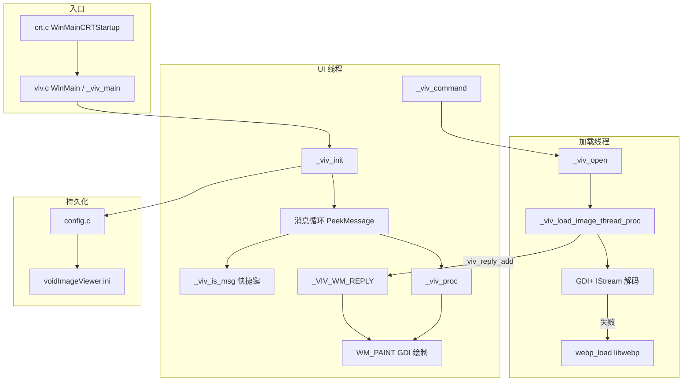
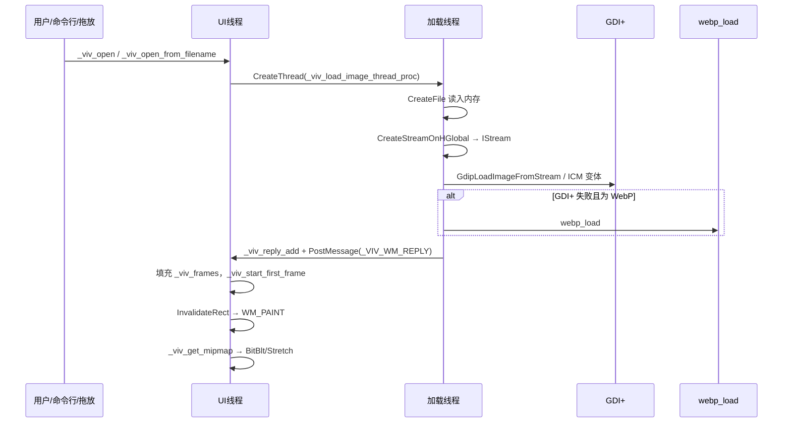

# voidImageViewer 程序基本架构说明书

| 项目 | 说明 |
|------|------|
| 文档版本 | 1.0 |
| 对应程序版本 | 1.0.0.16（`VERSION_YEAR=2026`，`VERSION_BUILD=16`） |
| 分析基准 | 源码树 `voidImageViewer-1.0.0.15` |
| 读者对象 | 维护者、二次开发者、代码审阅者 |

相关文档：[升级开发指导建议书.md](./升级开发指导建议书.md)

---

## 1. 概述

**void Image Viewer**（voidImageViewer）是由 voidtools / David Carpenter 开发的 **Windows 轻量级图像查看器**，目标是尽快打开并显示常见静态与动画图像，并尽可能准确地播放 GIF / 动画 WebP。

| 维度 | 内容 |
|------|------|
| 许可 | 主程序 MIT；内嵌 libwebp 遵循其 BSD 风格许可（见根目录 `LICENSE`） |
| 平台 | 仅 Windows（工程支持 Win32 / x64 / ARM / ARM64） |
| 语言 | 纯 C（Win32 API；部分 COM 接口以 C 风格调用） |
| 主版本定义 | [`src/version.h`](../src/version.h) |
| 发行与讨论 | [GitHub Releases](https://github.com/voidtools/voidImageViewer/releases)、[voidtools 论坛](https://www.voidtools.com/forum/viewtopic.php?t=5623) |

### 1.1 支持的图像格式

| 格式 | 说明 |
|------|------|
| BMP、GIF、ICO、JPEG、PNG、TIFF | 经系统 **GDI+** 解码（运行时动态加载 `gdiplus.dll`） |
| WEBP（含动画） | GDI+ 失败时由内嵌 **libwebp**（`src/webp.c`）解码 |
| 多帧 | GIF、动画 WebP、多页 TIFF 等按帧装入 `_viv_frame_t` 数组 |

### 1.2 主要用户可见能力（代码侧）

- 视图：1:1、Best Fit、Fill Window、Pan/Scan、全屏、离散缩放表
- 动画：播放 / 暂停 / 帧步进 / 速率；幻灯片（全屏 + 可配置间隔）
- 导航：上一张 / 下一张、播放列表、自然排序、shuffle、Jump To
- 文件：复制 / 移动 / 删除 / 重命名 / 打印 / 设壁纸 / 属性；EXIF `System.Photo.Orientation`
- 集成：与 [Everything](https://www.voidtools.com/) 搜索 IPC；文件关联与安装命令行；Options → General 可将 VoidImageViewer 写入资源管理器右键菜单（`SystemFileAssociations`，不改默认打开程序）
- 性能相关：mipmap 缩小、下一张预加载（`config_preload_next`）、上一张缓存（`config_cache_last`）
- 像素取样：状态栏左下角实时显示光标下源像素；整图判定为灰度时显示 `Gray`，否则显示 `RGB`（`config_pixel_info` / INI `statusbar_pixel_info`）

---

## 2. 技术栈与构建

### 2.1 技术栈

| 层次 | 技术 |
|------|------|
| UI | 原生 Win32：窗口、菜单、工具栏、Rebar、状态栏、Common Controls |
| 图像解码 | GDI+（主路径）+ libwebp（WebP 回退） |
| 渲染（当前生效） | GDI：`WM_PAINT` 中 `BitBlt` / 自定义 stretch + mipmap |
| 配置 | 自研轻量 INI（`ini.c`）+ 全局 `config_*` 变量 |
| 打包 | NSIS（`nsis/installer.nsi`） |

### 2.2 构建入口

| 路径 | 用途 |
|------|------|
| [`vs2019/voidImageViewer.sln`](../vs2019/voidImageViewer.sln) | **主推荐** Visual Studio 2019 解决方案 |
| [`vs2019/voidImageViewer.vcxproj`](../vs2019/voidImageViewer.vcxproj) | 工具集 v142、Windows SDK 10.0；直接编译应用源与 libwebp 选定源文件 |
| [`vs2005/`](../vs2005/) | 遗留 VS2005 工程 |
| [`libwebp/`](../libwebp/) | 完整 vendored 树（自带 CMake/Autotools 等）；主工程不依赖其顶层构建，而是由 vcxproj 编入 |

无独立的主程序 CMake/Makefile；发布安装包由 NSIS 脚本生成。

---

## 3. 目录结构

```
voidImageViewer-1.0.0.15/
├── src/           # 应用全部源码（C）
├── res/           # Win32 资源（.rc、Manifest、图标、对话框）
├── libwebp/       # 内嵌 Google libwebp 源码树
├── vs2019/        # 当前主构建工程
├── vs2005/        # 遗留工程
├── nsis/          # 安装程序脚本
├── docs/          # 本架构与升级文档
├── README.md      # 用户向简介与截图链接
├── Changes.txt    # 版本变更日志
└── LICENSE        # 许可全文
```

### 3.1 `src/` 源文件职责一览

| 文件 | 职责 |
|------|------|
| `crt.c` / `crt.h` | 自定义 CRT 入口 `WinMainCRTStartup`（减小 CRT 依赖） |
| `viv.c` / `viv.h` | **核心单体**：窗口过程、命令、加载、导航、渲染、选项、安装/关联、Everything |
| `config.c` / `config.h` | 全局设置变量；`config_load_settings` / `config_save_settings` |
| `ini.c` / `ini.h` | 轻量 INI 读写 |
| `os.c` / `os.h` | OS 封装；**运行时** `LoadLibrary` GDI+ 等函数指针 |
| `webp.c` / `webp.h` | libwebp 封装：`webp_load(IStream*, callbacks)` |
| `mem.c` / `mem.h` | 分配器（Debug 可带泄漏追踪） |
| `small_pool.c` / `small_pool.h` | 栈式 bump allocator |
| `string.c` / `utf8.c` / `wchar.c` | 路径与编码辅助 |
| `safe_size.c` / `safe_size.h` | 安全尺寸运算 |
| `debug.c` / `debug.h` | `debug_printf` 等调试输出 |
| `everything_ipc.h` | Everything 搜索 IPC 协议常量与结构 |
| `version.h` | 版本宏 |
| `render.h` | 渲染抽象 `render_t`（**尚未接入主路径**） |
| `render.c`、`render_gdi.c`、`render_software.c` | 空壳或占位 |
| `render_d3d.c`、`render_opengl.c` | 大量遗留代码，整文件以 `#if 0` 禁用 |

### 3.2 其他目录

| 路径 | 用途 |
|------|------|
| `res/voidImageViewer.rc` | 菜单、对话框、图标、字符串等 UI 资源 |
| `res/resource.h` | 资源 ID |
| `nsis/installer.nsi` | 安装 / 卸载与关联逻辑脚本侧 |

---

## 4. 总体架构

程序是典型的 **单体 Win32 桌面应用**：几乎全部业务逻辑集中在 `viv.c`（约 15000 行），辅以配置、OS 封装与 WebP 薄层。运行时划分为：

1. **UI 线程**：消息循环、快捷键拦截、窗口绘制、配置与菜单命令。
2. **加载线程**：读文件、GDI+/WebP 解码，通过回复队列把帧数据投递回 UI 线程。



设计要点：

- **单实例默认**：Mutex 名 `"VOIDIMAGEVIEWER"`；已有实例时通过 `FindWindowA` + `WM_COPYDATA` 转发命令行（可用配置允许多实例）。
- **渲染抽象未完成**：`render.h` 定义了 `render_t` 回调表，但当前绘制逻辑直接写在 `viv.c` 的 `WM_PAINT` 中。
- **Everything 为可选外部依赖**：通过窗口消息 IPC，不链接 Everything 库。

---

## 5. 启动与生命周期

### 5.1 调用链

```
crt.c: WinMainCRTStartup()
  → viv.c: WinMain()
    → _viv_main(nCmdShow)
      → _viv_init()          // 初始化
      → 消息循环              // PeekMessage + _viv_is_msg + WaitMessage
      → _viv_kill()          // 清理退出
```

关键符号位置（均在 `viv.c`，行号随版本可能微调）：

| 符号 | 作用 |
|------|------|
| `WinMain` | 标准入口包装 |
| `_viv_main` | 初始化 → 循环 → 清理 |
| `_viv_init` | OS/配置/Mutex/COM/GDI+/窗口/命令行 |
| `_viv_proc` | 主窗口过程 |
| `_viv_fullscreen_proc` | 全屏相关窗口过程 |
| `_viv_kill` | 释放帧、线程、配置保存等 |

### 5.2 `_viv_init` 主要步骤

1. `os_init()` — 动态加载 GDI+、Shell32、User32 等。
2. `config_load_settings()` — 读取 INI。
3. 单实例 Mutex（`CreateMutexA("VOIDIMAGEVIEWER")`）；冲突则转发命令行并退出。
4. `CoInitializeEx`、`InitCommonControlsEx`、`os_GdiplusStartup`。
5. 注册窗口类，创建主窗口 `_viv_hwnd`、工具栏 / 状态栏 / Rebar。
6. `_viv_process_command_line(GetCommandLineW())` — 解析 `/slideshow`、`/fullscreen` 等。
7. `ShowWindow`。

### 5.3 消息循环特点

- 优先 `_viv_is_msg(&msg)` 拦截键盘 / 鼠标快捷键（可不进入 `DispatchMessage`）。
- 其余消息走标准 `TranslateMessage` / `DispatchMessage`。
- 空闲时 `WaitMessage()`，降低空转占用。

---

## 6. 核心模块职责

### 6.1 主应用（`viv.c`）

| 职责域 | 关键符号（示例） |
|--------|------------------|
| 窗口过程 | `_viv_proc`、`_viv_fullscreen_proc` |
| 命令分发 | `_viv_command`、`_viv_command_with_is_key_repeat` |
| 打开 / 加载 | `_viv_open`、`_viv_open_from_filename`、`_viv_load_image_thread_proc` |
| 导航 | `_viv_next`、`_viv_home`、`_viv_playlist_*`、`_viv_shuffle_playlist` |
| 渲染辅助 | `_viv_get_mipmap`、`_viv_get_render_size` |
| 缩放 / 平移 | `_viv_zoom_in`、`_viv_view_scroll`、`_viv_view_set`、`_viv_dst_zoom_set` |
| 动画 | `_viv_timer_start` / `_viv_timer_stop`、`_viv_animation_pause`、`_viv_frame_step` |
| 幻灯片 | `_viv_slideshow`、定时器 ID `VIV_ID_SLIDESHOW_TIMER` |
| 选项 UI | `_viv_options`、`_viv_options_treeview_changed` |
| 安装 / 关联 | `_viv_install_association`、`_viv_process_install_command_line_options` |
| Everything | `_viv_search_everything`、`_viv_send_everything_search` |

公开菜单 ID、部分 API 与 include 组织见 [`src/viv.h`](../src/viv.h)。

### 6.2 配置与输入

| 模块 | 职责 |
|------|------|
| `config.c` / `config.h` | 全部 `config_*` 全局状态；加载 / 保存 |
| `ini.c` | INI 解析与写出 |
| `viv_key_add` 等（`viv.h` / `viv.c`） | 命令快捷键绑定持久化 |

### 6.3 基础设施

| 模块 | 职责 |
|------|------|
| `os.c` | Win32 与 GDI+ 函数指针封装；`os_get_orientation`（EXIF 方向） |
| `webp.c` | WebP 静图 / 动画解码回调驱动 |
| `mem.c` / `small_pool.c` | 内存分配策略 |
| `everything_ipc.h` | 与 Everything 的 `WM_COPYDATA` / `EVERYTHING_WM_IPC` 协议 |

### 6.4 UI 资源

[`res/voidImageViewer.rc`](../res/voidImageViewer.rc) 定义菜单、选项对话框页（General / View / Controls）、图标与 Manifest。运行时行为由 `viv.c` 中对话框过程与命令 ID 驱动。

---

## 7. 关键数据结构

以下结构定义于 `viv.c`（非公开头文件，二次开发需注意封装边界）。

### 7.1 帧与 Mipmap

```c
// 单级 mipmap
typedef struct _viv_mip_s {
    HBITMAP hbitmap;
    struct _viv_mip_s *mipmap;
} _viv_mipmap_t;

// 动画/多页中的一帧
typedef struct _viv_frame_s {
    HBITMAP hbitmap;
    _viv_mipmap_t *mipmap;
    DWORD delay;              // 毫秒
} _viv_frame_t;
```

当前图像帧数组：`_viv_frames`；预加载：`_viv_preload_frames`；上一张缓存：`_viv_last_frames`。

### 7.2 播放列表

```c
typedef struct _viv_playlist_s {
    struct _viv_playlist_s *next;
    struct _viv_playlist_s *prev;
    WIN32_FIND_DATA fd;
} _viv_playlist_t;
```

双向链表，配合 shuffle 索引数组 `_viv_playlist_shuffle_indexes`。

### 7.3 加载线程回复

```c
typedef struct _viv_reply_s {
    struct _viv_reply_s *next;
    DWORD type;
    DWORD size;
    // data follows
} _viv_reply_t;
```

回复类型枚举：

| 常量 | 含义 |
|------|------|
| `_VIV_REPLY_LOAD_IMAGE_FIRST_FRAME` | 首帧就绪（含宽高、帧数） |
| `_VIV_REPLY_LOAD_IMAGE_ADDITIONAL_FRAME` | 后续动画帧 |
| `_VIV_REPLY_LOAD_IMAGE_COMPLETE` | 加载完成 |
| `_VIV_REPLY_LOAD_IMAGE_FAILED` | 失败 |

UI 侧通过自定义消息 `_VIV_WM_REPLY`（`WM_USER+1`）消费队列。

### 7.4 其他

| 类型 | 用途 |
|------|------|
| `_viv_nav_item_t` | Jump To / 导航列表项 |
| `_viv_webp_t` | WebP 解码过程临时上下文 |
| `_viv_command_t` / `_viv_default_key_t` | 菜单命令与默认快捷键表 |

---

## 8. 关键数据流

### 8.1 打开图像 → 显示



步骤摘要：

1. 入口：`_viv_open_from_filename` / `_viv_open(WIN32_FIND_DATA*, is_preload)`。
2. 加载线程：整文件读入 → `IStream` → EXIF 方向 → GDI+ 逐帧；失败则 `webp_load`。
3. 回复队列：`_viv_reply_add` → `_VIV_WM_REPLY`。
4. UI：挂接帧数组、启动动画定时器（如需要）、触发绘制。

### 8.2 导航（下一张）

```
_viv_next(prev, ...)
  → 遍历 _viv_playlist 或 FindFirstFile/FindNextFile 扫描目录
  → _viv_fd_compare() 按 config_nav_sort / 升序 / 自然排序
  → _viv_open(&best_fd, is_preload)
```

相关优化：

- `config_preload_next`：后台 `_viv_open(..., is_preload=1)`。
- `config_cache_last`：`_viv_activate_last()` 复用 `_viv_last_frames`。
- 切换文件时设 `_viv_load_image_terminate=1`，并排队 `_viv_load_image_next_fd`。

### 8.3 动画与幻灯片

| 机制 | 行为 |
|------|------|
| 动画定时器 `VIV_ID_ANIMATION_TIMER` | 按帧 `delay` 推进 `_viv_frame_position` |
| 幻灯片 `_viv_slideshow` | 进入全屏 + `VIV_ID_SLIDESHOW_TIMER` → `_viv_next(0, ...)` |
| 防休眠 | `SetThreadExecutionState`（动画 / 幻灯片时，受 `config_prevent_sleep` 等控制） |

---

## 9. 图像解码与渲染

### 9.1 解码路径

| 顺序 | 路径 | 说明 |
|------|------|------|
| 1 | GDI+ | `os_GdipLoadImageFromStream` / `GdipLoadImageFromStreamICM`（受 `config_icm` 影响） |
| 2 | WebP | GDI+ 失败时 `webp_load`（`src/webp.c` + `libwebp`） |

加载策略特点：当前通过 **整文件读入内存** 再 `CreateStreamOnHGlobal` 得到 `IStream`。源码注释提到流式 `_viv_istream_t` 曾伤害 GIF 加载性能，故暂保留 HGlobal 方案——大文件内存峰值较高。

### 9.2 当前渲染路径（生效）

- 位置：`viv.c` 的 `WM_PAINT` 处理。
- 按可见区域 clip，避免无意义全图 stretch。
- `_viv_get_mipmap()` 选择合适 mip 级别加速缩小。
- 等比缩放优先 `BitBlt`；放大使用自定义 stretch（因 `StretchBlt` 放大时对 clip 行为不理想）。
- 过滤模式受 `config_shrink_blit_mode`、`config_mag_filter`（COLORONCOLOR / HALFTONE）影响。

### 9.3 遗留 / 未启用渲染代码

| 文件 | 状态 |
|------|------|
| `render.h` | 定义 `render_t` 抽象，**未接入**主路径 |
| `render_d3d.c`、`render_opengl.c` | 大体量历史实现，`#if 0` 禁用 |
| `render_gdi.c`、`render_software.c`、`render.c` | 空壳或注释占位 |

演进建议见 [升级开发指导建议书.md](./升级开发指导建议书.md) 的 P2 阶段。

---

## 10. 配置与扩展点

### 10.1 INI 位置

段名：`[voidImageViewer]`，文件名：`voidImageViewer.ini`。

| 模式 | 路径 |
|------|------|
| 便携（默认 `config_appdata=0`） | 与 `voidImageViewer.exe` 同目录 |
| AppData（`config_appdata=1` 或命令行 `/appdata`） | `%APPDATA%\voidImageViewer\voidImageViewer.ini` |

加载：`config_load_settings()`；保存：退出或 `WM_ENDSESSION` 等路径调用 `config_save_settings()`。

### 10.2 主要配置项（节选）

完整列表见 [`src/config.h`](../src/config.h)。常用项包括：

| 类别 | 变量示例 |
|------|----------|
| 窗口几何 | `config_x/y/wide/high`、`config_maximized` |
| 视图 | `config_keep_aspect_ratio`、`config_fill_window`、`config_auto_zoom*`、背景色 RGB |
| 导航 | `config_nav_sort`、`config_nav_sort_ascending`、`config_shuffle` |
| 性能 | `config_preload_next`、`config_cache_last`、`config_shrink_blit_mode`、`config_mag_filter` |
| 交互 | `config_mouse_wheel_action`、`config_ctrl_mouse_wheel_action`、`config_left_click_action` 等 |
| 显示 | `config_show_status`、`config_show_controls`、`config_show_menu`、`config_pixel_info`（默认开启：状态栏最左侧实时显示光标像素；灰度图为 `Gray: N`，彩色图为 `RGB: r,g,b`，另附 `POS: x,y`） |
| 方向 / 标题 | `config_orientation`、`config_title_bar_format` |
| 实例 | `config_multiple_instances` |
| 幻灯片 | `config_slideshow_rate`、`config_slideshow_custom_rate*` |

快捷键按命令 ID 持久化（`viv_key_add` 机制）。

### 10.3 命令行（节选）

由 `_viv_process_command_line` / `_viv_command_line_options` 处理，帮助文本中可见例如：

- `/slideshow`、`/fullscreen`、`/shuffle`
- `/rate`、窗口位置尺寸类开关（`/x` `/y` `/width` `/height` 等）
- `/everything` 相关搜索、`/minimal` `/compact` 等 UI 模式
- 安装 / 关联相关开关（`_viv_process_install_command_line_options`）
- 1.0.0.14+：`-` 形式开关；可用引号或文件名中含 `.` 的方式转义

完整列表以运行程序时的帮助输出或 `viv.c` 中 `_viv_command_line_options` 字符串为准。

### 10.4 Everything 集成

- 协议头：[`src/everything_ipc.h`](../src/everything_ipc.h)。
- 用途：搜索图片并打开 / 加入播放列表、随机搜索等。
- 依赖用户机器上 Everything 服务 / 窗口可用，非硬链接库依赖。

### 10.5 文件关联与安装

- 运行时默认打开关联：`_viv_install_association_by_extension` 等写 `HKCU\Software\Classes`（Options → General 中按扩展名勾选，会改默认打开程序）。
- 资源管理器右键菜单：`_viv_install_explorer_context_menu` / `_viv_uninstall_explorer_context_menu`，写入 `HKCU\Software\Classes\SystemFileAssociations\.<ext>\shell\VoidImageViewer`（Options → General 中 **Add VoidImageViewer to Explorer context menu**）；写入当前用户、无需管理员，且**不改变**默认打开程序。
- 发行：`nsis/installer.nsi` 负责安装包流程；代码 TODO 中仍列出 MSI、仅当前用户安装、ARM 安装包等未完成项。

---

## 11. 已知局限（架构层面）

以下为源码结构客观结论；改进路径见升级指导文档。

1. **巨型单体**：`viv.c` 集中 UI、加载、渲染、选项、安装，认知与合并冲突成本高。
2. **死代码负担**：`render_d3d.c` / `render_opengl.c` 等大体积禁用代码仍存在于树中并可能参与工程列举。
3. **渲染抽象未落地**：`render_t` 与实际 `WM_PAINT` 路径脱节。
4. **加载内存模型**：整文件进内存，大图 / 网络盘峰值与延迟不理想。
5. **线程协作复杂**：terminate / preload / cache_last 分支多，历史缺陷见 `Changes.txt`（多帧中断崩溃、预加载与外部改文件不一致等）。
6. **平台绑定**：纯 Win32；MinGW、暗色主题、高 DPI 图标、本地化 string table 等仍在 TODO。
7. **文档原状**：发行版仅有 README / Changes；本 `docs/` 为二次整理的开发者文档。

---

## 12. 推荐阅读顺序

1. [`src/version.h`](../src/version.h) — 版本
2. [`src/crt.c`](../src/crt.c) — 入口
3. [`src/viv.c`](../src/viv.c) — `_viv_init`、消息循环、`_viv_load_image_thread_proc`、`WM_PAINT`
4. [`src/viv.h`](../src/viv.h) — 命令 ID 与公开声明
5. [`src/config.h`](../src/config.h) / [`src/config.c`](../src/config.c) — 设置面
6. [`src/os.c`](../src/os.c) — GDI+ 动态加载
7. [`src/webp.c`](../src/webp.c) — WebP
8. [`res/voidImageViewer.rc`](../res/voidImageViewer.rc) — UI 资源
9. [`vs2019/voidImageViewer.vcxproj`](../vs2019/voidImageViewer.vcxproj) — 编译单元与 libwebp 源列表
10. [`Changes.txt`](../Changes.txt) — 行为演进与历史缺陷

---

## 附录 A. 版本信息摘录

```c
// src/version.h
#define VERSION_YEAR        2026
#define VERSION_MAJOR       1
#define VERSION_MINOR       0
#define VERSION_REVISION    0
#define VERSION_BUILD       16
#define VERSION_TYPE        ""
```

近期变更要点（详见 `Changes.txt`）：大图预览黑屏修复、状态栏灰度/RGB 像素信息、Explorer 右键菜单选项、大图滚动修复、小键盘偏移、WebP 背景色、大于 65536 逻辑尺寸渲染、幻灯片/动画防屏保、`title_bar_format`、EXIF Orientation、mipmap / preload / cache_last 等。

---

## 附录 B. 依赖一览

| 类别 | 依赖 |
|------|------|
| 内嵌第三方 | libwebp（dec / demux / dsp / utils 等，由 vcxproj 列出） |
| 系统 DLL（动态） | `gdiplus.dll` 等（经 `os.c`） |
| 系统库（链接侧典型） | user32、gdi32、shell32、shlwapi、uxtheme、comdlg32 等 |
| COM | `IStream`、`IPropertyStore`（方向元数据）等 |
| 可选外部进程 | Everything（IPC） |
